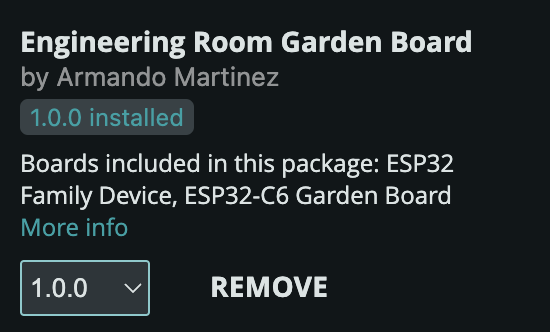

# Steps to install this board in the Arduino IDE

---

## Step 1: Go to the Arduino settings/preferneces

## Step 2: Copy and paste URL into the 'Additional boards manager URLs'

[https://github.com/Sunewst/garden-board/releases/download/1.0.0/package_garden_board_index.json]

---

The board should now appear in board manager when you look it up

